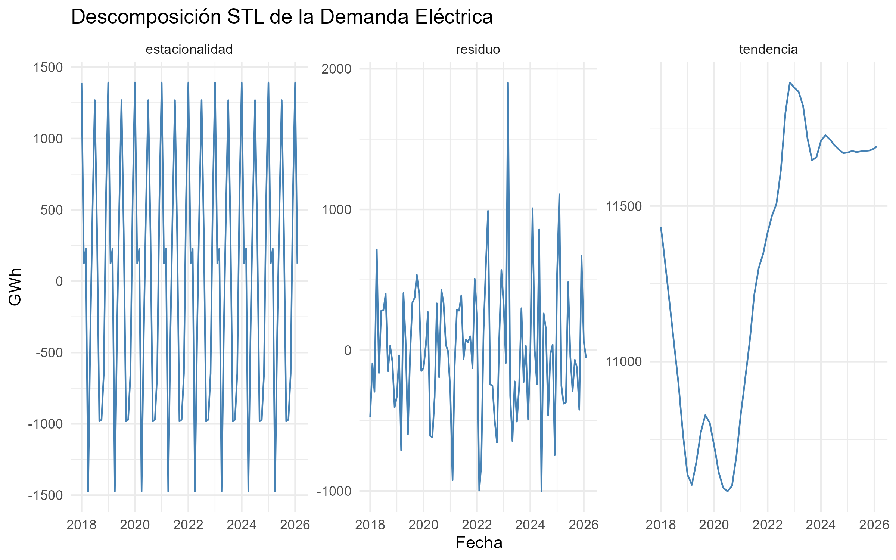
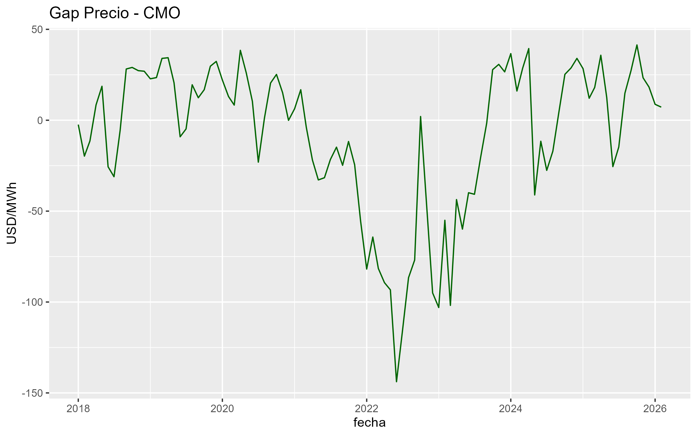
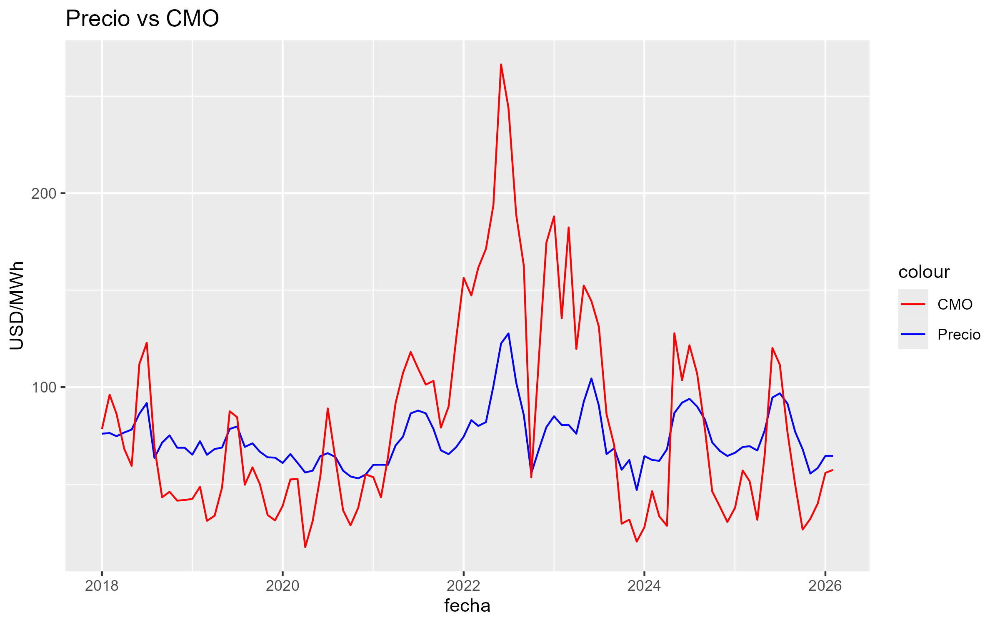

# ⚡ Análisis de Demanda y Precio de Energía (MEM Argentina)

## 📊 Descripción

Este proyecto analiza la relación entre la demanda eléctrica, el costo marginal y el precio de la energía en el Mercado Eléctrico Mayorista (MEM) de Argentina en el período 2018 a Febrero 2026.

A partir de datos mensuales, se construye un indicador de "gap" entre precio y costo, y se evalúa su comportamiento en el tiempo mediante herramientas de series temporales y modelos econométricos.

El objetivo central es responder una pregunta clave:

> **¿El precio de la energía refleja realmente su costo?**

---

## 📁 Estructura del Proyecto

01_data/

├── raw/        # Datos originales (Excel)

├── processed/  # Datos limpios y transformados

02_scripts/

├── 01_clean_data.R

├── 02_processing.R

├── 03_analysis.R

├── 04_modeling.R

├── 05_visualizations.R

├── run_all.R

03_output/

└── graficos/

            ├── descomposicion_stl.png
    
            ├── gap.png
    
            ├── gap_resumen.png
    
            ├── precio_vs_cmo.png

⚙️ Metodología

🔹 1. Preparación de datos

Limpieza del dataset original del MEM
Tratamiento de valores faltantes
Construcción de una serie temporal consistente

🔹 2. Ingeniería de variables

Se utilizaron y construyeron las siguientes variables clave:

* Demanda eléctrica (GWh)
* Precio monómico
* Costo marginal (CMO)
* Gap = Precio – Costo
* Variable dummy indicadora de reforma

🔹 3. Análisis de series temporales

### Descomposición STL para identificar tendencia, estacionalidad y ruido:

  

Hallazgos:

* Fuerte componente estacional (asociado a ciclos de demanda)
* Cambios estructurales en el tiempo

🔹 4. Modelado econométrico

Se estimó el siguiente modelo:

gap ~ demanda * post_reforma

Resultados principales:

* La demanda tiene un efecto significativo sobre el gap
* La variable de reforma no resulta estadísticamente significativa
* No se detecta un cambio estructural fuerte

🔹 5. Test de cambio estructural

Test de Chow:

p-valor ≈ 0.12
→ No se rechaza la hipótesis de estabilidad estructural

📈 Visualizaciones clave

### Evolución del Gap

  

### Precio vs Costo Marginal

  

📌 Key Findings

- El precio de la energía no sigue de forma consistente al costo marginal
- La demanda tiene un rol relevante en la dinámica del sistema
- No se detecta evidencia estadística fuerte de un cambio estructural tras la reforma
- Existe una dinámica de desacople parcial entre señales económicas y precios finales

🧠 Conclusión

- Los resultados sugieren que el precio de la energía no está completamente alineado con su costo marginal.
- Si bien la demanda influye en el gap precio-costo, no se observa evidencia robusta de un cambio estructural tras la reforma analizada.
- Esto podría indicar la presencia de mecanismos de fijación de precios que no responden plenamente a señales de mercado.
- El análisis muestra cómo herramientas econométricas simples pueden aportar evidencia útil para entender dinámicas complejas del mercado energético.

🚀 Reproducibilidad

Para ejecutar todo el pipeline:

   source("02_scripts/run_all.R")

🛠️ Herramientas utilizadas

R

tidyverse

ggplot2

forecast

strucchange
